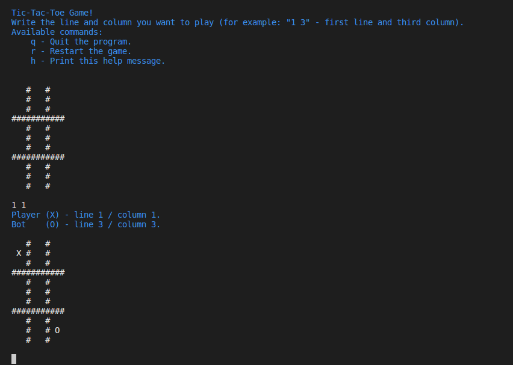

# Tic-tac-toe console game #

# Installation #

- brew tap drk4/homebrew-tap https://bitbucket.org/drk4/homebrew-tap/
- brew install tic_tac_toe

Then run the `tic_tac_toe` command in the terminal.

# Bot Logic #

The bot first tries to complete a row, either to win the game or deny the win to the opponent. Otherwise it plays at random.

This is not the perfect way to play, so its still possible to win the game (otherwise it would draw every time).

# Development #

- `swift run` --- Build and run the game.
